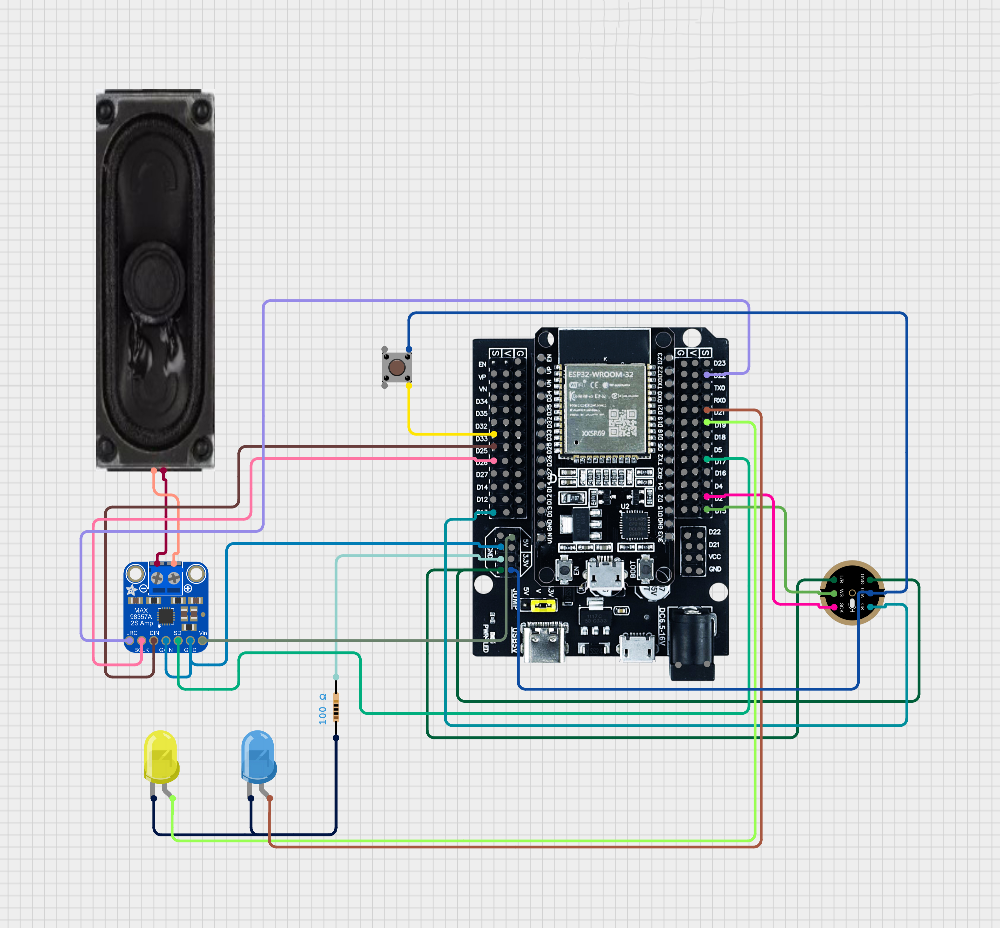
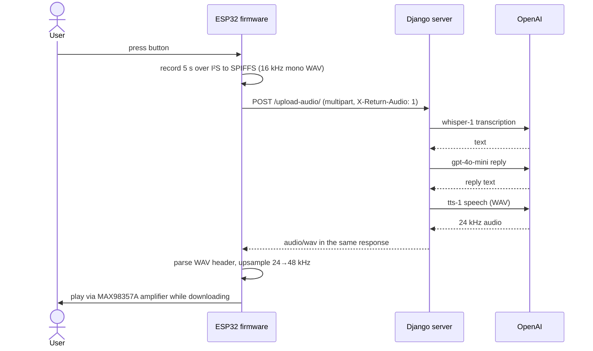

# AVA — IoT AI Voice Assistant

AVA is a push-to-talk voice assistant built from an ESP32, a MEMS microphone and a
small amplifier. Press the button, speak for five seconds, and AVA answers out loud.

The ESP32 records the audio and uploads it to a Python server, which transcribes it
(Whisper), generates a short reply (GPT-4o mini), turns the reply into speech (TTS),
and returns the WAV in the same HTTP response. The device plays it as it downloads.

Built as my graduation project.



## How it works



One request, one response: the device never polls. The server saves both sides of
the exchange as `Conversation` rows.

## Where to look

| File | What it does |
|---|---|
| [`firmware/ava_esp32/ava_esp32.ino`](firmware/ava_esp32/ava_esp32.ino) | Button debounce, I²S recording to SPIFFS, hand-built multipart upload over a raw `WiFiClient`, chunked-transfer decoding, WAV header parsing, 24→48 kHz upsampling and I²S playback. |
| [`server/voiceapp/views.py`](server/voiceapp/views.py) | `upload_audio`: accepts multipart *or* a raw WAV body, enforces a size limit while streaming to disk, runs the speech → GPT → speech pipeline, and returns JSON or WAV depending on the client. |
| [`server/voiceapp/models.py`](server/voiceapp/models.py) | `Conversation` — one row per user utterance and per assistant reply. |
| [`server/voiceapp/pages.py`](server/voiceapp/pages.py) | Browser side: sign-in, sign-up and a text chat that reuses the same GPT call, saving history per user. |
| [`server/voiceapp/templates/`](server/voiceapp/templates/voiceapp), [`static/`](server/voiceapp/static/voiceapp) | The sign-in and chat pages. |

## Hardware

| Part | ESP32 pins |
|---|---|
| INMP441 I²S microphone | WS 15 · SD 13 · SCK 2 |
| MAX98357A I²S amplifier | DIN 25 · BCLK 26 · LRC 22 · SD (enable) 17 |
| Push button (to 3V3, internal pull-down) | 33 |
| Wi-Fi status LED | 21 |
| Recording / transfer LED | 19 |

## Running it

### Server

Requires Python 3.10+ and an OpenAI API key.

Windows (PowerShell):

```powershell
cd server
python -m venv .venv
.venv\Scripts\Activate.ps1
pip install -r requirements.txt
python manage.py migrate

$env:OPENAI_API_KEY = "sk-..."
python manage.py runserver 0.0.0.0:8000
```

macOS / Linux:

```bash
cd server
python3 -m venv .venv
source .venv/bin/activate
pip install -r requirements.txt
python manage.py migrate

export OPENAI_API_KEY="sk-..."
python manage.py runserver 0.0.0.0:8000
```

The server listens on all interfaces (`0.0.0.0`) so the ESP32 can reach it over the LAN.

| Variable | Default | Purpose |
|---|---|---|
| `OPENAI_API_KEY` | — (required) | Whisper, GPT and TTS calls |
| `DJANGO_SECRET_KEY` | insecure dev key | Set a real one outside local development |
| `DJANGO_DEBUG` | `1` | `0` to disable debug mode |
| `DJANGO_ALLOWED_HOSTS` | `*` | Comma-separated hostnames |

Test the pipeline without the hardware:

```bash
curl -X POST -H "Content-Type: audio/wav" --data-binary @sample.wav \
     "http://localhost:8000/upload-audio/?format=wav" --output reply.wav
```

### Firmware

1. Copy `firmware/ava_esp32/config.example.h` to `config.h` in the same folder and set
   your Wi-Fi credentials and the server's LAN address. `config.h` is git-ignored.
2. Open `firmware/ava_esp32/ava_esp32.ino` in the Arduino IDE with the ESP32 board
   package installed, and upload.
3. Open the serial monitor at 115200 baud. The Wi-Fi LED stays on once connected.

## API

| Method | Path | Description |
|---|---|---|
| `POST` | `/upload-audio/` | Multipart (`audio` or `file` field) or raw `audio/wav`, max 25 MB. Returns `{transcription, gpt_response}` as JSON, or the spoken reply as `audio/wav` when the request sends `Accept: audio/wav`, `?format=wav` or `X-Return-Audio: 1`. |
| `GET` | `/broadcast-audio/` | The most recently generated reply as WAV. |
| `GET` | `/check-variable/` | `{ready: true}` once a reply has been generated. |
| `GET` | `/get-conversations/` | Conversation history for the signed-in user. |

Browser pages: `/` (landing), `/signin/`, `/signup/` and `/chat/`; sign out with
`POST /signout/`. The chat page posts `{"message": "..."}` to `/chat-text/` and
clears history with `POST /api/conversations/clear/`. Both need a signed-in
session and a CSRF token.

## Limitations and next steps

- **Single-device state.** The latest reply is tracked in a module-level variable, so
  `/broadcast-audio/` assumes one device and one server process. A per-device or
  per-session key would remove that assumption.
- **Open upload endpoint.** `/upload-audio/` has no authentication, so anyone on the
  network can spend API credit. A per-device token sent as a header would fix this.
- **Fixed five-second recording.** Voice-activity detection on the ESP32 would let
  users speak naturally instead of racing a timer.
- **Audio accumulates.** Recordings and spoken replies are kept under
  `server/media/audio/` and nothing cleans them up.
